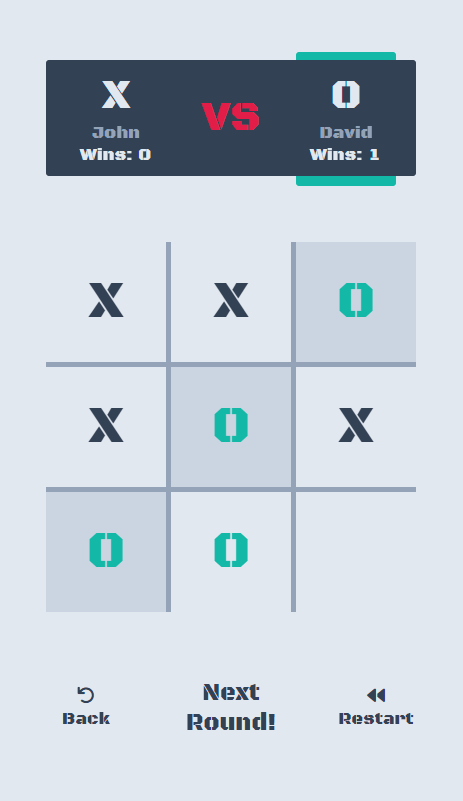

### Project: [Tic-Tac-Toe](https://gdimitroff.github.io/tic-tac-toe/)

Browser version of Tic Tac Toe game created with **HTML**, **CSS** and **JavaScript**. The project is from The Odin Project [curriculum](https://www.theodinproject.com/lessons/node-path-javascript-tic-tac-toe).

### Features

- You **can choose to play** against another human or computer
- **Computer chooses** its moves **at random**
- At the end of the game the **you can choose to play new round, reset scores or go back and select different game mode**

### Outcome

- Used **HTML5 semantic elements** for better structure and readability
- Used **CSS Grid** to make books grid fully responsive
- Used **CSS Flexbox** module to create layout
- Adapted **fancy style** for input placeholders
- Implemented basic **animations**
- Learned how to use _animationend_ event
- Learned how to **"transition"** display block elements
- Deepened knowledge of **DOM manipulation**, **HTML structure**, **CSS styling subtleties** and **JS functionality** in general

